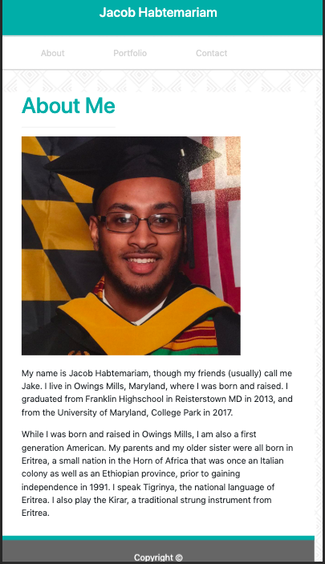
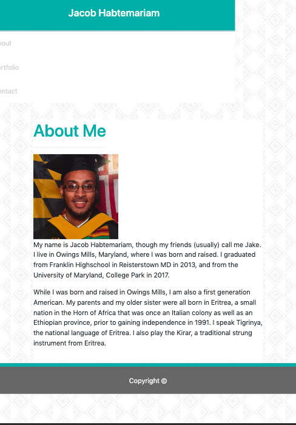
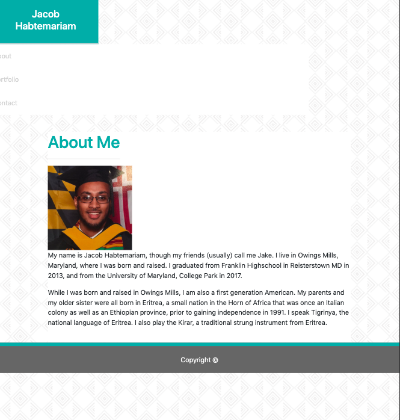
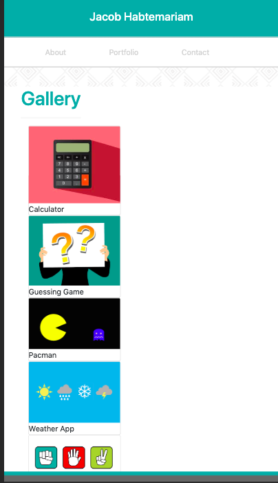
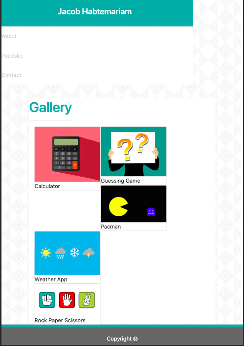
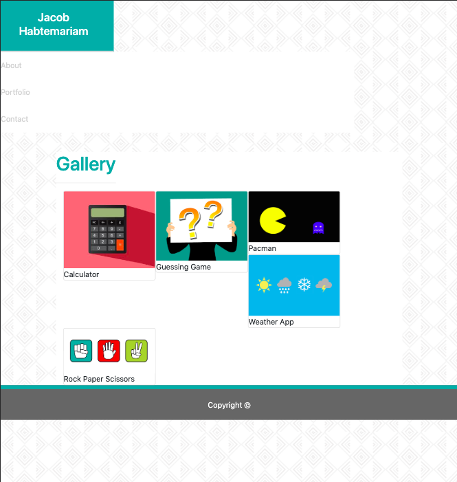
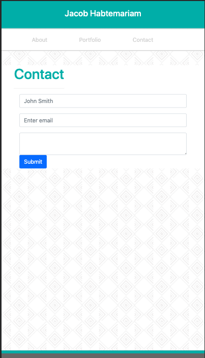
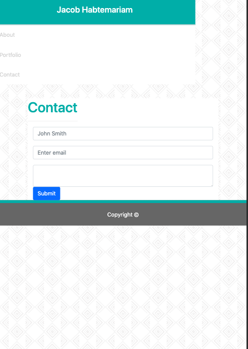
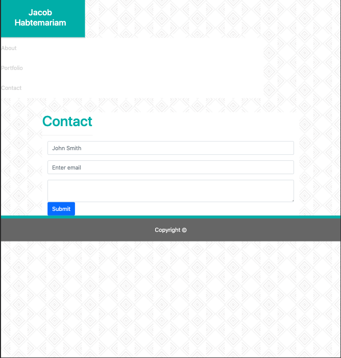

# HW-02
# Jacob Habtemariam - Responsive Portfolio Assignment

### Accessing the Site

* The site can be accessed at the following link - https://jemnetu.github.io/HW-02/index.html

### Usage

* This site begins on the homepage titled "About Me". You can navigate between the three pages of the site by clicking on the "About", "Portfolio", and "Contact" links in the page header. These links link to the homepage, portfolio page, and contact page respectively.

*  Additionally you can return to the homepage at any time by clicking on the colored  in the header, labled with my name.

* The contact page contains a basic contact form that consists of a form element with 3 inputs and a submit botton. 

* The background image "Greek Vase Pattern" used on all the pages was found on the site https://www.toptal.com/designers/subtlepatterns/. The image was created by Myriam Lefebvre and is protected by the following license: https://creativecommons.org/licenses/by-sa/3.0/legalcode

### Images of The Site

### Technologies Used
* This site uses Bootstrap templates for styling, in conjunction with my own custom CSS stylesheet. Bootstrap styling can be found on the Bootstrap site: https://getbootstrap.com/ 

### License
* The license for this site can be found in the LICENSE.md file in the root directory.
